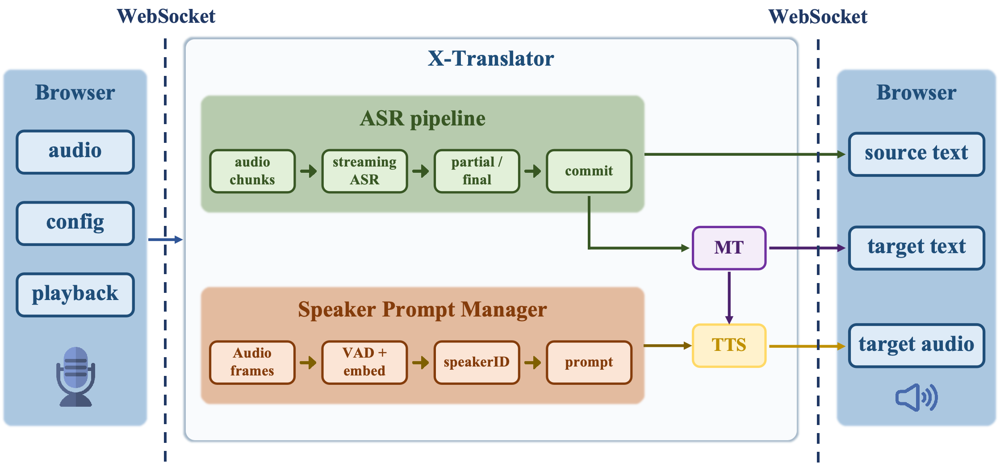
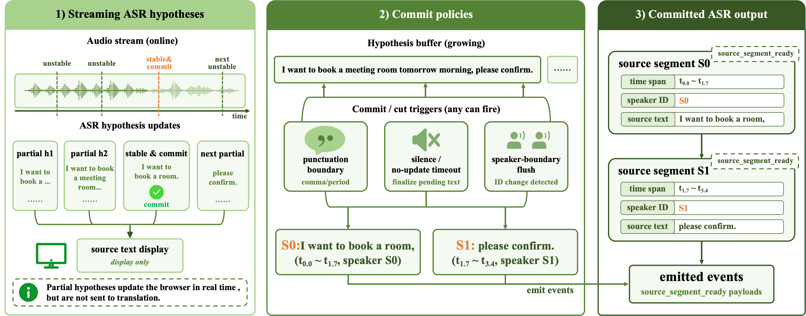
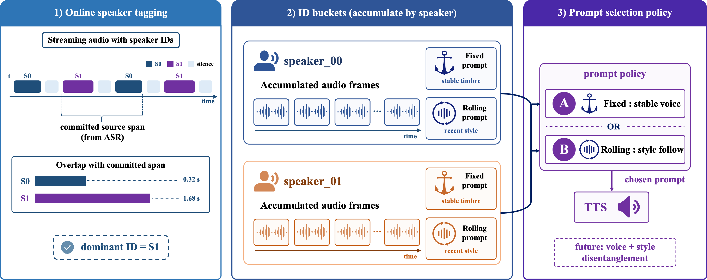

# X-Translator

[English](README.md) | 中文

X-Translator 是一个模块化、低成本的语音到语音翻译演示系统。它通过轻量级运行时控制器连接流式 ASR、机器翻译和基于提示音频的 TTS，让浏览器在实时会话中展示源语音识别文本、翻译文本和合成后的目标语音。

当前版本主要发布本地 demo 代码。完整 server 代码、评测代码和论文将在后续发布。

## 特性

- 基于浏览器的实时演示，支持 WebSocket 音频流。
- ASR、MT 和 TTS 后端可插拔。
- 增量 ASR 片段提交，用于生成可翻译的源语音单元。
- 面向说话人的 prompt 路由，用于保持目标语音中的说话人特征。

## 系统架构



## 运行时设计





## 目录结构

- `backend/`：FastAPI 后端、运行时控制器、ASR/MT/TTS 客户端和会话逻辑。
- `frontend/`：静态浏览器 demo 界面。
- `server/`：部分后端服务的本地启动示例。
- `main.py`：本地应用入口。
- `config.json`：默认运行配置。
- `start.sh`：demo 启动脚本。

## 环境配置

```bash
cd xtranslate
python -m venv .venv
source .venv/bin/activate
pip install -e .
```

如果使用 CUDA 12.4，可以安装对应的 PyTorch 版本：

```bash
pip install torch==2.6.0+cu124 torchaudio==2.6.0+cu124 torch-complex==0.4.4 --extra-index-url https://download.pytorch.org/whl/cu124
```

## 基本配置

运行前修改 `config.json`。通常只需要关注以下字段：

- `server.host` 和 `server.port`：本地 Web 服务地址。
- `asr.provider`：ASR 后端，例如 `qwen3`、`sensevoice`、`paraformer` 或 `zipformer`。
- `translation.provider`：MT 后端，例如 `lmt` 或 `hunyuan`。
- `tts.provider`：TTS 后端，例如 `xvoice` 或 `index`。
- 各后端服务 URL，例如 `asr.qwen3_asr_url`、`translation.lmt_url` 和 `tts.xvoice_tts_url`。
- `translation.source_lang` 和 `translation.target_lang`：源语言和目标语言代码。

默认配置假设后端服务运行在本地。启动浏览器 demo 前，请先启动 `config.json` 中选择的 ASR、MT 和 TTS 服务。

## 运行 Demo

在线 demo：

```text
https://translate.sjtuxlance.com/
```

```bash
bash start.sh
```

默认本地 demo 地址为：

```text
http://0.0.0.0:7654
```

## TODO

- [x] Release demo code.
- [ ] Release full server code.
- [ ] Release evaluation code.
- [ ] Release paper.

## Citation

论文挂到 arXiv 后会补充正式引用。

```bibtex
@misc{xtranslator2026,
  title        = {X-Translator},
  author       = {TBD},
  year         = {2026},
  archivePrefix = {arXiv},
  eprint       = {TBD}
}
```

## Acknowledgements

感谢 XTalk、[X-ASR](server/X-ASR)、[Qwen3-ASR](https://github.com/QwenLM/Qwen3-Omni)、[Paraformer](https://github.com/modelscope/FunASR)、[SenseVoice](https://github.com/FunAudioLLM/SenseVoice)、[NiuTrans LMT](https://github.com/NiuTrans/LMT)、[Hunyuan-MT](https://github.com/Tencent-Hunyuan/Hunyuan-MT)、[X-Voice](https://arxiv.org/abs/2605.05611)、[IndexTTS](https://github.com/index-tts/index-tts) 和 [OpenSTBench](https://arxiv.org/abs/2605.30792) 对语音翻译生态的贡献。

X-Translator 代码使用 MIT License 发布。本项目使用到的第三方模块、模型和服务遵循其原始协议。
